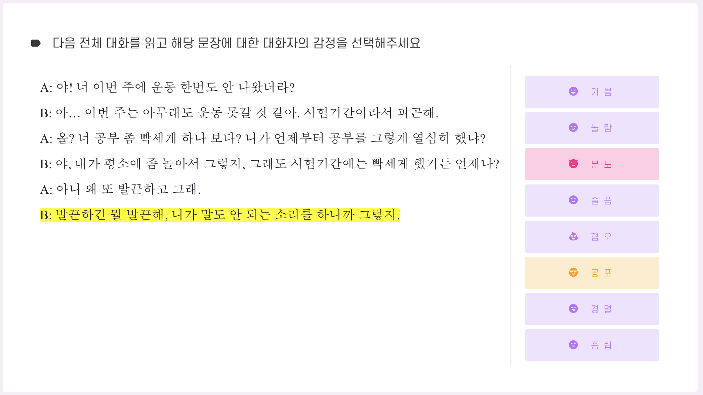
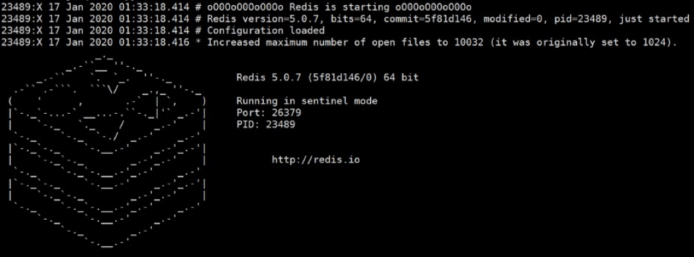

## 와이즈돔

[와이즈돔](http://wisedome.kr) 은 클라우드 환경에서 인공지능 학습을 위한 데이터를 수집 및 관리하는 웹 서비스이다.

와이즈돔을 통해 인공지능 데이터를 필요로 하는 사람은 쉽게 데이터를 구할 수 있고, 수 많은 사람들은 다양한 작업을 통해 일자리를 얻을 수 있다.

<table align="center" height="700">
  <thead>
  <tr align="center">
    <th colspan ="2">Screenshot</th>
    </tr>
  </thead>
  <tbody>
    <tr>
      <td colspan = "2"></td>
    </tr>
    <tr>
      <td></td>
      <td></td>
    </tr>
  </tbody>
</table>


## 개발 환경

* Ubuntu 18.04.3 LTS
* Python >= 3.6
* PostgreSQL >= 9.5
* Redis >= 2.6
* pip >= 6.1


## 설치 방법

**1. 초기 설정**

```shell
  # 소스 코드 받기
  git clone https://github.com/gocks456/wisedome.git
  
  # 소스 코드 디렉토리에 액세스
  cd wisedome
  
  # 와이즈돔에 필요한 필수 라이브러리 설치
  sudo apt-get install python-dev build-essential libjpeg-dev libssl-dev libffi-dev
  sudo apt-get install dbus libdbus-1-dev libdbus-glib-1-dev libldap2-dev libsasl2-dev
  
  # virtualenv Python3 active (가상 환경 생성 및 활성화 후)
  # Upgrade pip
  pip install -U pip
  # 와이즈돔 파이썬 라이브러리 설치
  pip install -r requirements.txt
```

**2. 와이즈돔 설정 및 DB 연결**

```shell
cp setting_local.py.tmpl settings_local.py
# 개인 설정에 맞게 수정
vim settings_local.py

cp alembic.ini.tmpl alembic.ini
# DB URL 수정
```

**3. 백그라운드 작업**

와이즈돔은 백그라운드 작업을 통해 관리자의 불편함을 감소시킨다.

만약 백그라운드 작업이 정상적으로 작동하지 않을 시 일부 기능이 동작하지 않는다.

**​	3-1) Redis**

```shell
# Redis 설치
sudo apt-get install redis-server
```

* Redis-server: 마스터 노드로서 읽기 및 쓰기 작업 수행
* Redis-sentinel: 마스터 및 슬레이브 노드를 구성

> Redis의 자세한 사항은 [Redis Docs](https://redis.io/) 를 참고하세요.

```shell
# contrib/sentinel.conf 설정
sentinel monitor mymaster 127.0.0.1 6379 2
sentinel down-after-milliseconds mymaster 60000
sentinel failover-timeout mymaster 180000
sentinel parallel-syncs mymaster 1

# Redis 실행
redis-server contrib/sentinel.conf --sentinel
```




**​	3-2) RQ**

``` shell
# RQ Scheduler 실행
rqscheduler --host "redis host" --port "redis port" --interval "반복할 주기"

# RQ Worker 실행
python app_context_rqworker.py scheduled jobs super high medium low maintenance
```


**4. DB 설정**

와이즈돔은 [PostgreSQL](https://www.postgresql.org/) 데이터베이스를 사용한다.

```shell
# PostgreSQL DB 생성
sudo su postgres
createuser -d -P 사용자이름
createdb 데이터베이스이름 -O 사용자이름
exit
```

> 사용자 이름과 데이터베이스 이름은 Setting_local.py, alembic.ini 설정과 동일해야 함

```shell
# DB 테이블 생성
python cli.py db_create
```


**5. 실행**

```shell
# run.py 실행
python run.py
```

> 와이즈돔의 템플릿 코드는 비공개이므로 웹 접속 시 에러가 발생할 수 있음

